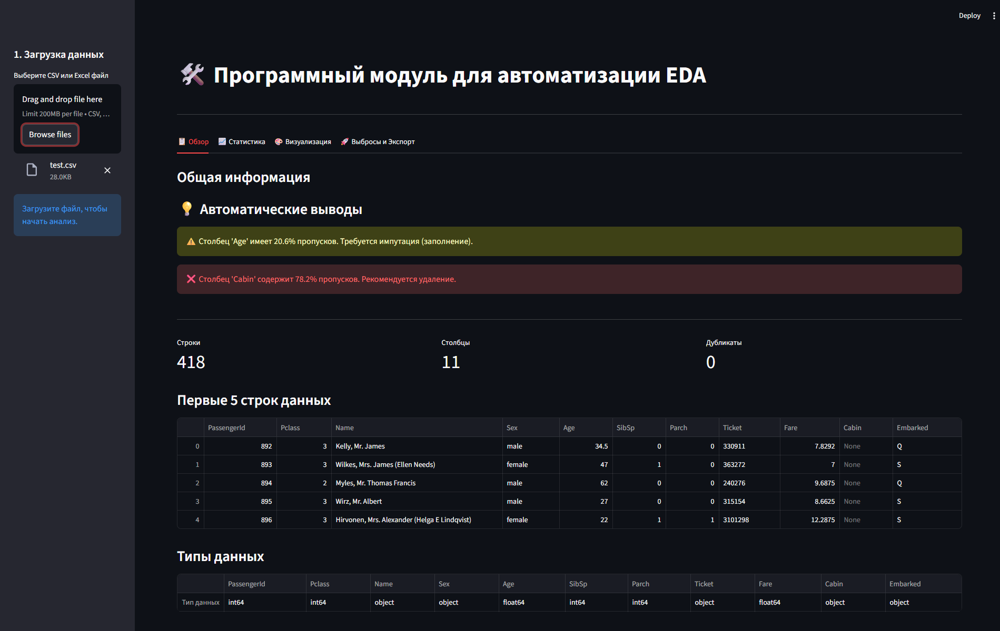
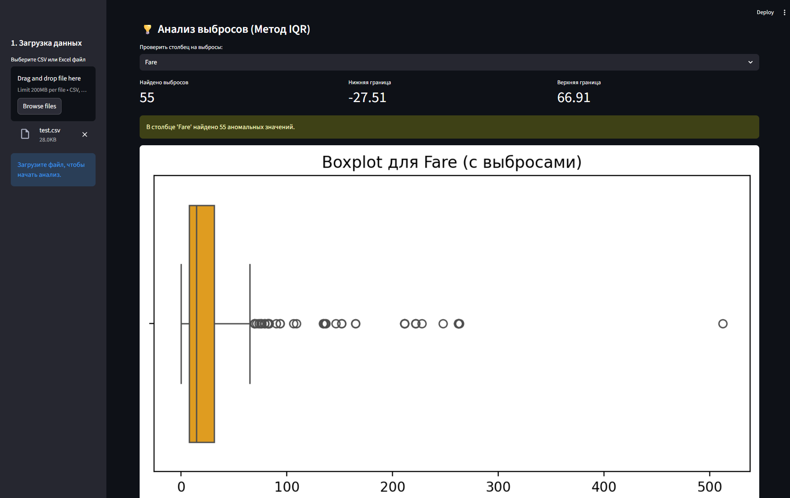

<a id="top"></a>

<div align="center">

# Automated EDA Tool

### Exploratory Data Analysis · Streamlit App · Data Quality Report

<p>
  <a href="#ru"></a>
  &nbsp;
  <a href="#en"></a>
</p>

<p>
  
  
  
  
</p>

<sub>Web application for automated exploratory data analysis of CSV and Excel datasets</sub>

</div>

<br>

---

<br>

<a id="ru"></a>

## Русская версия

<div align="right"><a href="#top">↑ Наверх</a> · <a href="#en">English →</a></div>

> **Automated EDA Tool** — программный модуль для автоматизации разведочного анализа данных.  
> Приложение позволяет загрузить датасет в формате CSV или Excel и быстро получить статистический обзор, визуализации, проверку качества данных и автоматически сформированные предупреждения.

| | |
|---|---|
| **Тип проекта** | Веб-приложение для анализа данных |
| **Основной сценарий** | Быстрый первичный анализ датасета без ручного написания однотипного кода |
| **Форматы данных** | CSV, XLSX |
| **Интерфейс** | Streamlit |
| **Статус** | Портфолио / учебно-прикладной проект |

### Содержание

1. [Контекст и задача](#ru-context)
2. [Возможности](#ru-features)
3. [Скриншоты](#ru-screenshots)
4. [Архитектура](#ru-architecture)
5. [Технологии](#ru-stack)
6. [Установка и запуск](#ru-run)
7. [Структура проекта](#ru-structure)
8. [Дальнейшее развитие](#ru-roadmap)

---

<a id="ru-context"></a>

### Контекст и задача

Разведочный анализ данных часто начинается с повторяющихся действий, постоянно приходится загружать файл датасета, проверять размерность таблицы, типы признаков, пропуски, дубликаты, распределения, выбросы и корреляции. В основном эти шаги выполняются вручную в ноутбуках, что занимает время и усложняет быстрый просмотр новых датасетов.

**Цель проекта** — сделать компактный инструмент, который автоматизирует базовые этапы EDA и помогает быстро понять структуру датасета, возможные проблемы качества данных и признаки, требующие отдельного внимания.

---

<a id="ru-features"></a>

### Возможности

#### Загрузка и первичная обработка данных

| Возможность | Описание |
|------------|----------|
| CSV / Excel | Поддержка загрузки файлов `.csv` и `.xlsx` |
| Кодировки | Автоматическая попытка чтения популярных кодировок: `utf-8`, `cp1251`, `latin1` |
| Устойчивость к ошибкам | Обработка ошибок парсинга и пропуск проблемных строк при чтении данных |
| Быстрый предпросмотр | Отображение первых строк датасета перед детальным анализом |

#### Статистический обзор

- размерность датасета: количество строк и столбцов;
- определение типов данных;
- подсчёт дубликатов;
- анализ пропущенных значений;
- описательная статистика для числовых признаков;
- обзор категориальных признаков и частот значений.

#### Автоматические инсайты

- поиск константных столбцов;
- предупреждения о высоком проценте пропусков;
- выявление сильных корреляций между числовыми признаками;
- базовая проверка дисбаланса классов;
- подсветка потенциальных проблем качества данных.

#### Визуальный анализ

- гистограммы распределений;
- boxplot-графики для оценки разброса и выбросов;
- матрица корреляций;
- scatter plots для анализа связей между признаками;
- bar charts для категориальных данных.

#### Работа с выбросами

- поиск аномалий методом межквартильного размаха (IQR);
- просмотр признаков с потенциальными выбросами;
- возможность очистки данных;
- скачивание обработанного файла.

---

<a id="ru-screenshots"></a>

### Скриншоты

#### Главный дашборд



#### Анализ выбросов



---

<a id="ru-architecture"></a>

### Архитектура

Проект разделён на интерфейсный слой и ядро анализа данных. Streamlit отвечает за загрузку файлов, отображение виджетов и вывод результатов, а основная логика обработки вынесена в отдельный модуль.

```text
┌────────────────────┐
│  Streamlit UI      │
│  app.py            │
└─────────┬──────────┘
          │
          ▼
┌────────────────────┐
│  EDAProcessor      │
│  eda_core.py       │
└─────────┬──────────┘
          │
          ▼
┌────────────────────┐
│  Pandas / NumPy    │
│  Data processing   │
└─────────┬──────────┘
          │
          ▼
┌────────────────────┐
│  Matplotlib /      │
│  Seaborn charts    │
└────────────────────┘
```

| Компонент | Назначение |
|----------|------------|
| `app.py` | Точка входа, Streamlit-интерфейс, загрузка файла и отображение результатов |
| `eda_core.py` | Основная логика анализа данных, расчёт статистик, поиск проблем и подготовка данных |
| `requirements.txt` | Список зависимостей проекта |
| `screenshots/` | Скриншоты интерфейса для README |

---

<a id="ru-stack"></a>

### Технологии

| Технология | Использование |
|-----------|---------------|
| **Python 3.10+** | Основной язык разработки |
| **Streamlit** | Веб-интерфейс приложения |
| **Pandas** | Загрузка, очистка и анализ табличных данных |
| **NumPy** | Числовые операции |
| **Matplotlib** | Построение графиков |
| **Seaborn** | Статистическая визуализация |

---

<a id="ru-run"></a>

### Установка и запуск

#### 1. Клонирование репозитория

```bash
git clone https://github.com/mdkefir/automated-eda-tool.git
cd automated-eda-tool
```

#### 2. Создание виртуального окружения

Windows:

```bash
python -m venv venv
venv\Scripts\activate
```

macOS / Linux:

```bash
python3 -m venv venv
source venv/bin/activate
```

#### 3. Установка зависимостей

```bash
pip install -r requirements.txt
```

#### 4. Запуск приложения

```bash
streamlit run app.py
```

После запуска приложение будет доступно в браузере по локальному адресу, который выведет Streamlit в терминале.

---

<a id="ru-structure"></a>

### Структура проекта

```text
automated-eda-tool/
├── app.py                    # Точка входа и интерфейс Streamlit
├── eda_core.py               # Ядро анализа данных
├── requirements.txt          # Зависимости проекта
├── README.md                 # Документация
├── .gitignore                # Исключения Git
└── screenshots/              # Скриншоты интерфейса
    ├── dashboard.png
    └── outliers.png
```

---

<a id="ru-roadmap"></a>

### Дальнейшее развитие

- экспорт полного HTML/PDF-отчёта;
- расширенная настройка порогов для инсайтов;
- поддержка дополнительных форматов данных;
- автоматическая генерация текстового EDA-резюме;
- сохранение истории загруженных датасетов;
- более гибкая обработка выбросов и пропусков.

<div align="right"><a href="#en">English →</a></div>

<br>

---

<br>

<a id="en"></a>

## English Version

<div align="right"><a href="#top">↑ Back to top</a> · <a href="#ru">← Русский</a></div>

> **Automated EDA Tool** is a web application for automated exploratory data analysis.  
> It allows users to upload a CSV or Excel dataset and quickly get a statistical overview, visualizations, data quality checks, and automatically generated warnings.

| | |
|---|---|
| **Project type** | Data analysis web application |
| **Main use case** | Fast first-pass dataset analysis without writing repetitive notebook code |
| **Supported formats** | CSV, XLSX |
| **Interface** | Streamlit |
| **Status** | Portfolio / educational applied project |

### Table of Contents

1. [Context & Problem](#en-context)
2. [Features](#en-features)
3. [Screenshots](#en-screenshots)
4. [Architecture](#en-architecture)
5. [Tech Stack](#en-stack)
6. [Installation & Run](#en-run)
7. [Project Structure](#en-structure)
8. [Roadmap](#en-roadmap)

---

<a id="en-context"></a>

### Context & Problem

Exploratory data analysis often starts with the same repeated steps: loading a file, checking dataset shape, feature types, missing values, duplicates, distributions, outliers, and correlations. These operations are usually performed manually in notebooks, which slows down quick inspection of new datasets.

**Project goal** — build a compact tool that automates the basic EDA workflow and helps users quickly understand dataset structure, data quality issues, and features that require additional attention.

---

<a id="en-features"></a>

### Features

#### Data Loading & Initial Processing

| Feature | Description |
|---------|-------------|
| CSV / Excel | Upload `.csv` and `.xlsx` files |
| Encodings | Automatic reading attempts with common encodings: `utf-8`, `cp1251`, `latin1` |
| Error handling | Handles parsing errors and skips problematic rows when needed |
| Data preview | Shows the first rows of the dataset before detailed analysis |

#### Statistical Overview

- dataset shape: number of rows and columns;
- data type detection;
- duplicate counting;
- missing value analysis;
- descriptive statistics for numerical features;
- overview of categorical features and value frequencies.

#### Automated Insights

- constant column detection;
- warnings about high missing value percentage;
- detection of strong correlations between numerical features;
- basic class imbalance checks;
- highlighting potential data quality problems.

#### Visual Analysis

- distribution histograms;
- boxplots for spread and outlier inspection;
- correlation heatmap;
- scatter plots for feature relationship analysis;
- bar charts for categorical data.

#### Outlier Handling

- anomaly detection using the Interquartile Range (IQR) method;
- preview of features with potential outliers;
- optional data cleaning;
- download of the processed file.

---

<a id="en-screenshots"></a>

### Screenshots

#### Main Dashboard


#### Outlier Analysis


---

<a id="en-architecture"></a>

### Architecture

The project separates the UI layer from the data analysis core. Streamlit handles file upload, widgets, and result rendering, while the main processing logic is isolated in a separate module.

```text
┌────────────────────┐
│  Streamlit UI      │
│  app.py            │
└─────────┬──────────┘
          │
          ▼
┌────────────────────┐
│  EDAProcessor      │
│  eda_core.py       │
└─────────┬──────────┘
          │
          ▼
┌────────────────────┐
│  Pandas / NumPy    │
│  Data processing   │
└─────────┬──────────┘
          │
          ▼
┌────────────────────┐
│  Matplotlib /      │
│  Seaborn charts    │
└────────────────────┘
```

| Component | Purpose |
|-----------|---------|
| `app.py` | Entry point, Streamlit UI, file upload and result rendering |
| `eda_core.py` | Core data analysis logic, statistics, issue detection and data preparation |
| `requirements.txt` | Project dependencies |
| `screenshots/` | Interface screenshots for README |

---

<a id="en-stack"></a>

### Tech Stack

| Technology | Usage |
|-----------|-------|
| **Python 3.10+** | Main programming language |
| **Streamlit** | Web application interface |
| **Pandas** | Loading, cleaning and analyzing tabular data |
| **NumPy** | Numerical operations |
| **Matplotlib** | Plot generation |
| **Seaborn** | Statistical visualizations |

---

<a id="en-run"></a>

### Installation & Run

#### 1. Clone the repository

```bash
git clone https://github.com/mdkefir/automated-eda-tool.git
cd automated-eda-tool
```

#### 2. Create a virtual environment

Windows:

```bash
python -m venv venv
venv\Scripts\activate
```

macOS / Linux:

```bash
python3 -m venv venv
source venv/bin/activate
```

#### 3. Install dependencies

```bash
pip install -r requirements.txt
```

#### 4. Run the application

```bash
streamlit run app.py
```

After startup, Streamlit will print a local URL where the application is available in the browser.

---

<a id="en-structure"></a>

### Project Structure

```text
automated-eda-tool/
├── app.py                    # Entry point and Streamlit interface
├── eda_core.py               # EDA processing core
├── requirements.txt          # Project dependencies
├── README.md                 # Documentation
├── .gitignore                # Git ignored files
└── screenshots/              # Interface screenshots
    ├── dashboard.png
    └── outliers.png
```

---

<a id="en-roadmap"></a>

### Roadmap

- export of a full HTML/PDF report;
- configurable thresholds for automated insights;
- support for additional data formats;
- automatic text summary generation for EDA results;
- history of uploaded datasets;
- more flexible missing value and outlier handling.

<div align="right"><a href="#ru">← Русский</a></div>

<br>

---

<div align="center">

<sub>Automated EDA Tool · Python · Streamlit · Data Analysis Portfolio Project</sub>

<br>

<a href="#ru"></a>
&nbsp;
<a href="#en"></a>

</div>
